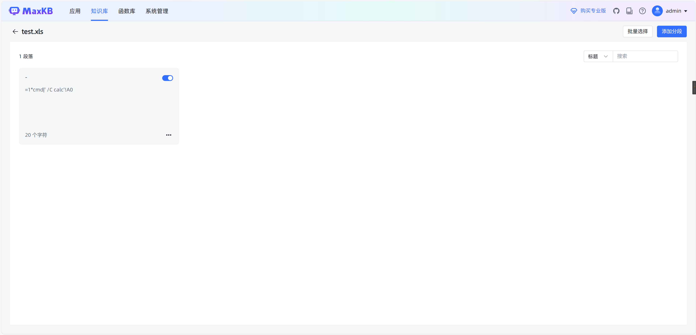
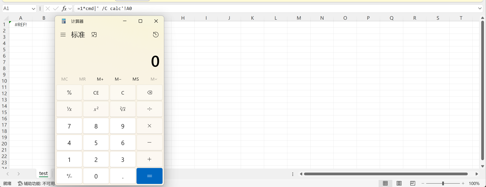

# Exploit Title: MaxKB v1.10.6-lts - CSV/XLS Injection
## Date: 4/28/2025
## Vendor Homepage: https://github.com/1Panel-dev/MaxKB?tab=readme-ov-file
## Tested on: Debian Linux, Apache, Mysql
## Vendor: MaxKB
## Version: v1.10.6-lts
## Exploit Description:
## An insecure file upload vulnerability was discovered in the Knowledge Base module of MaxKB v1.10.6-lts. The application allows users to upload `.csv`, `.xls`, and other spreadsheet files without properly validating or sanitizing their content. As a result, an attacker can upload a file containing malicious spreadsheet formulas (e.g., starting with `=`, `+`, `-`, or `@`). When other users download and open the file in spreadsheet software such as Microsoft Excel or LibreOffice Calc, the malicious payload can be executed, leading to potential security risks including command execution, phishing attacks, or data leakage.

## ---------------------------------POC-----------------------------

**Steps to Reproduce:**  
1. Prepare a `.csv` or `.xls` file containing a malicious formula, e.g., `=1*cmd|' /C calc'!A0`.
2. Upload the crafted file through the Knowledge Base upload functionality.
3. Another user downloads and opens the uploaded file.
4. Observe that the malicious formula is executed in their spreadsheet software.

**Impact:**  
Successful exploitation could allow an attacker to execute arbitrary actions within the victim's spreadsheet application, potentially leading to data compromise, phishing attacks, or further system exploitation.

**Recommendation:**  
- Implement strict content validation and sanitization for uploaded files, especially for spreadsheet formats.
- Sanitize or neutralize any cell content starting with dangerous characters (`=`, `+`, `-`, `@`) before making the files available for download.
- Consider restricting allowed file types or scanning uploaded files for potentially malicious content.

