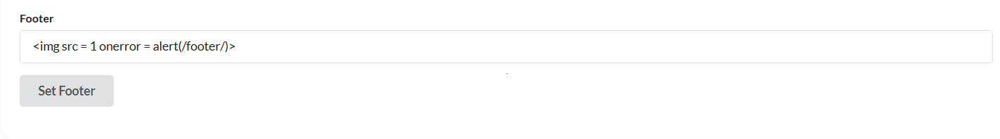
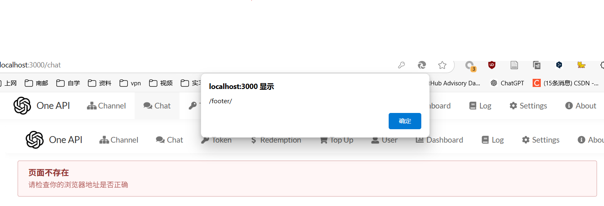

# Exploit Title: Concretecms latest - Cross-Site Scripting (XSS)
## Date: 4/8/2025
## Vendor Homepage: https://github.com/songquanpeng/one-api
## Tested on: Debian Linux, Apache, Mysql
## Vendor: one-api
## Version: latest
## Exploit Description:
## One-api latest suffers from a Stored Cross-Site Scripting (XSS) vulnerability in the system settings (other settings)，when add "" in Footer field. This vulnerability allows attackers to cheat other users by injecting malicious scripts into web pages viewed by other users.

## ---------------------------------POC-----------------------------

```


```

1. Log in as a user with settings editing privileges.
2. Add <script>alert('...');</script> to the Homepage Content、Footer、About System field,the xss vulnerability appears.

## POC


## effect

